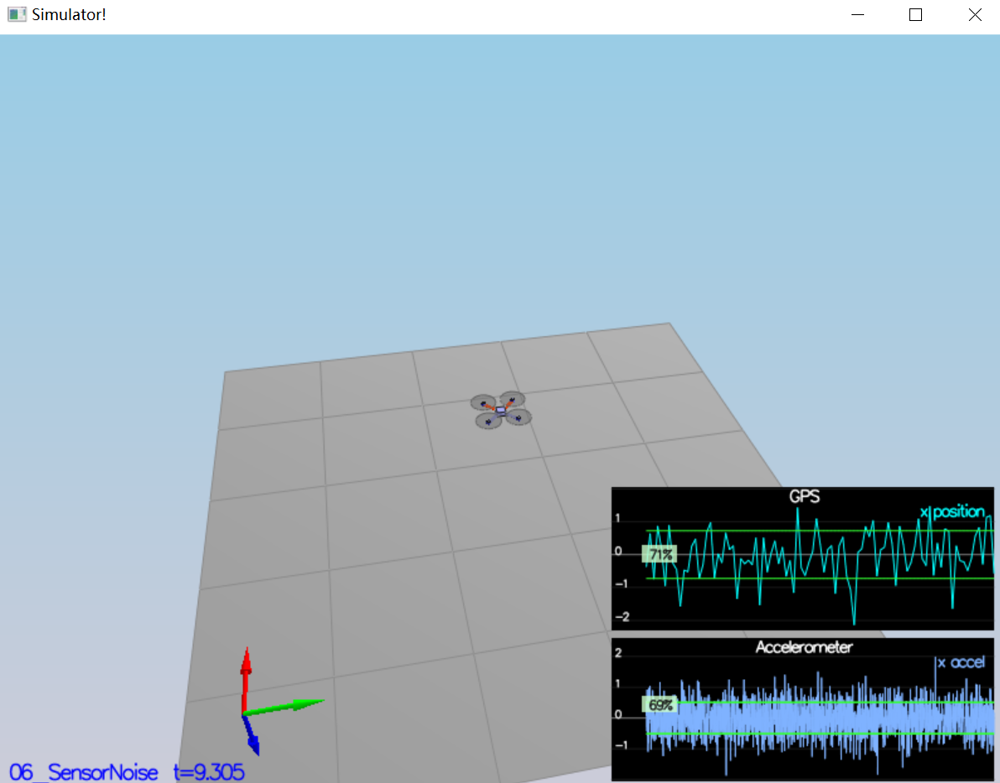
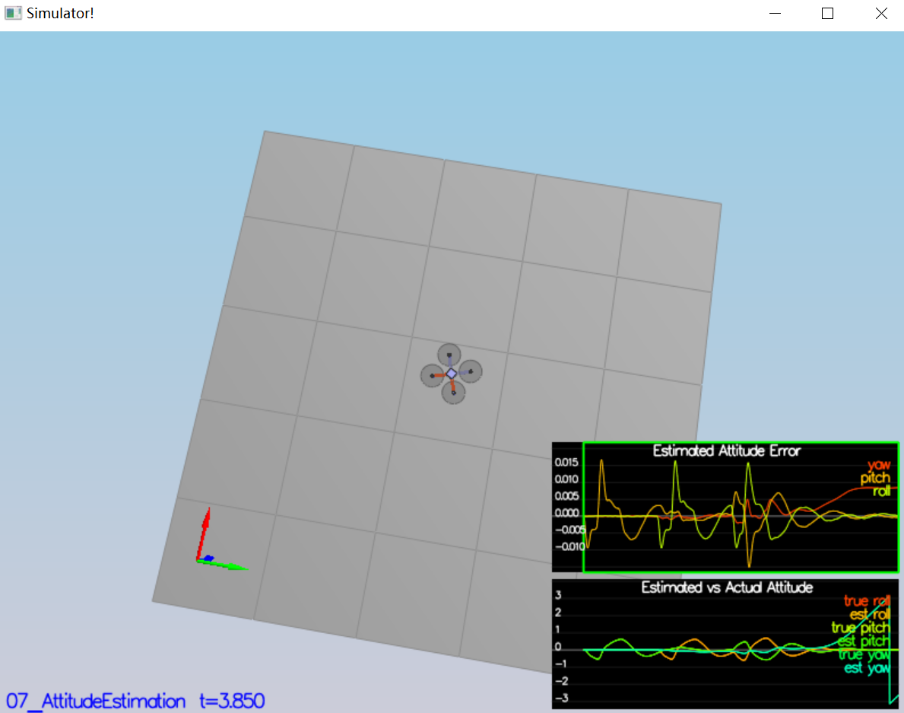
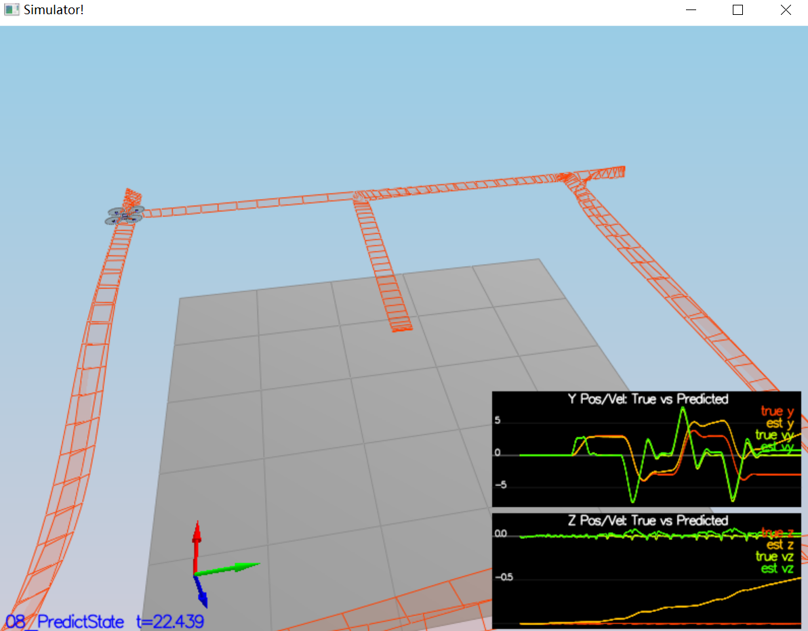
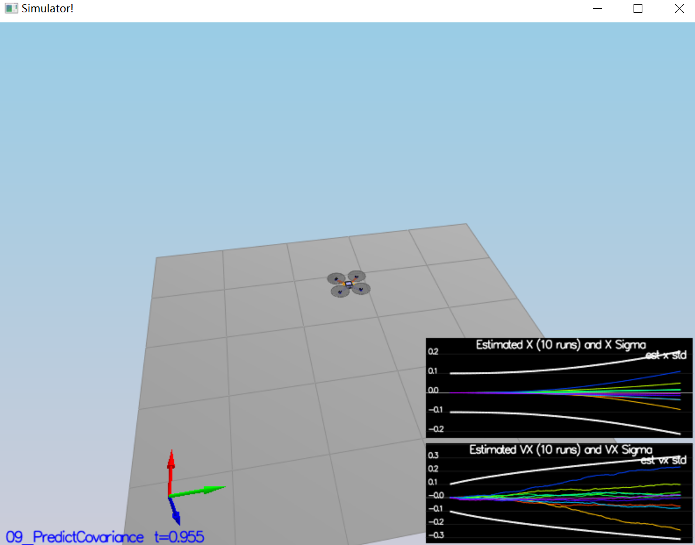
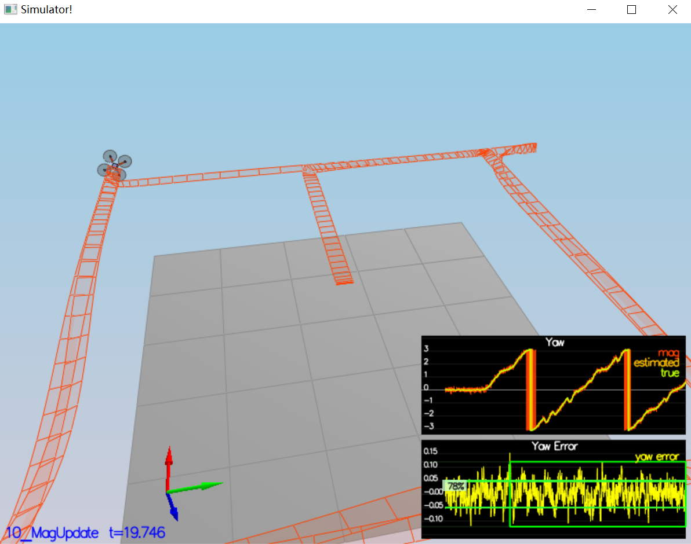
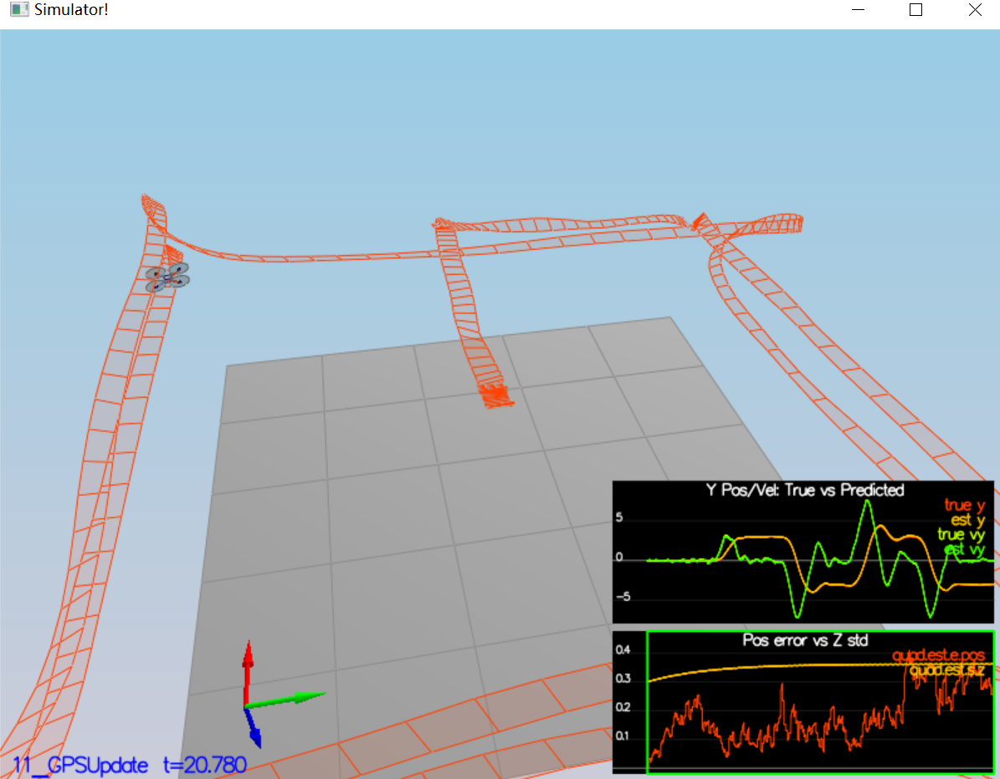

# Project: Estimator of a 3D Quadrotor #
This is one of my Udacity Nanodegree project of Flying cars.

Here are the contents of this project:
- Task 1: Sensor Noise
- Task 2: Attitude Estimation
- Task 3: Prediction Step
- Task 4: Magnetometer Update
- Task 5: Closed Loop + GPS Update
- Task 6: Adding Your Controller

## Task 1: Sensor Noise ##

1. Extract all the samples from log files `config/log/Graph1.txt` and `config/log/Graph2.txt` and compute the mean and standard deviation using the equations shown as follows.

2. Once standard deviations are calculated, replace the parameter with calculatd values.
`MeasuredStdDev_GPSPosXY = 0.726`
`MeasuredStdDev_AccelXY = 0.51`

3. When running scenario 8, we should see ~68% of the measurement points fall into the +/- 1 sigma bound.

## Task 2: Attitude Estimation ##

1. **Advanced gyro integration:**
An advanced gyro integration is implemented in `UpdateFromIMU()`, where a quaternion is first created using current estimated attitude in order to integrate gyro rate in its body frame. After integration, extract integrated pqr and transform them back to world frame.

2. After this advanced integration implementation, we should see in scenario 9 that the attitude errors reduced to within +/- 0.1 rad, as shown follows.

## Task 3: Prediction Step ##
1. **State prediction implementation:**
State prediction is done in `PredictState()` by simple integration of the drone's state vector.
2. When running scenario 8, we should see the estimator state track the actual state, with only reasonably slow drift, as shown in the figure below:

3. `GetRbgPrime()` implementation
Calculate the partial derivatives of the worldframe-bodyframe rotation matrix.

4. `Predict()` implementation
Create `gPrime` matrix in order to update covariance.

5. Tune `QPosXYStd` and the `QVelXYStd` and run scenario 9 to see how well the error model captures the real error. The figure is shown below. It is almost able to capture the error thoroughly.

## Task 4: Magnetometer Update ##

1. **Magnetometer update implementation:**
This is done by implementing the `hPrime` for updating yaw in function `UpdateFromMag()`. A range check of the difference in measured yaw and estimated yaw is also added. When running senario 10, the yaw error reduced greatly and is now able to stay less than +/-0.1 rad for more than 10 seconds, as shown in the following figure.

## Task 5: Closed Loop + GPS Update ##
1. **GPS Update:**
This is simply done by implementing `UpdateFromGPS()`, where `hPrime` matrix is computed for updating the drone's position and velocity.

2. **Entire simulation:**
The entire simulation of scenario 11 using an unideal estimator is shown in the figure below, with an error less than +/- 1m.

## Task 6: Adding Your Controller ##
Actually all the screenshots I showed so far were captured when using my own Controller from my previous project. All scenarios passed the success criteria although the flying trajectory is still a bit far from perfect.
